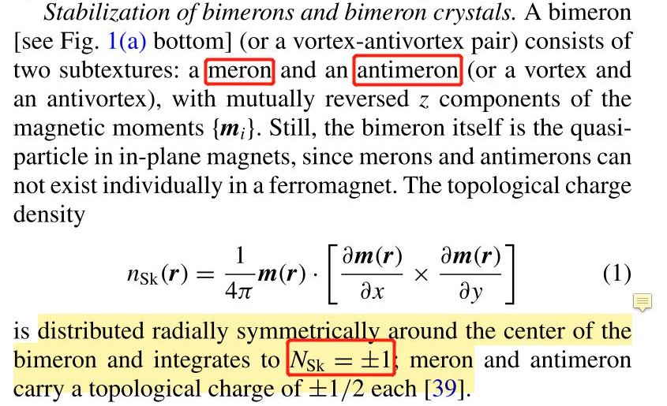
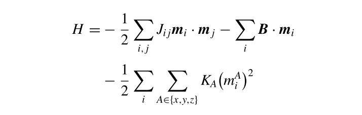
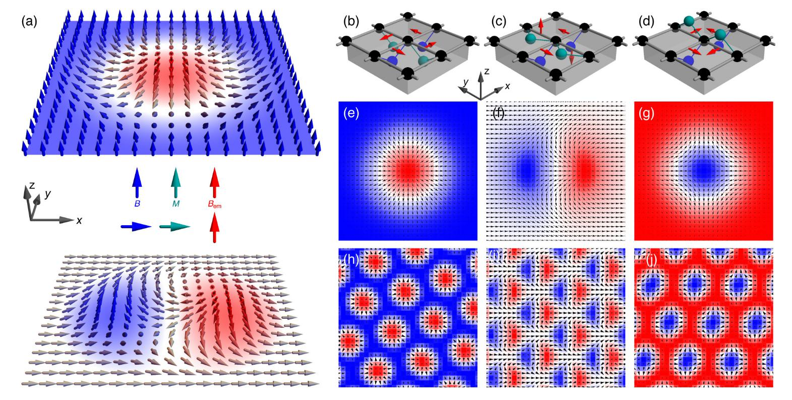
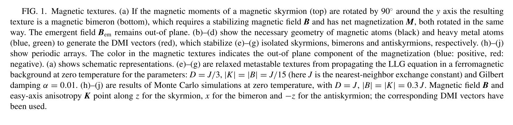
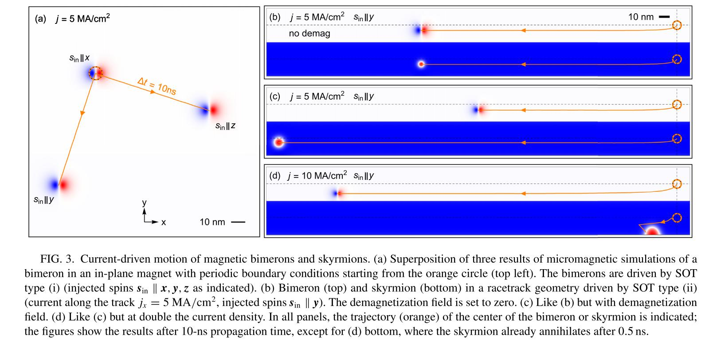

Bimerons 文献笔记
***
&sect; Bimerons 拓扑性质 

A bimeron is constructed by rotating each spin
 of a skyrmion by **90o** [cf. Fig. 1(a)] To find stable bimerons or bimeron crystals, one can there-
fore start from any system that stabilizes skyrmions and rotate every vectorial term in the Hamiltonian.
Following this idea, bimerons and bimeron crystals are
stabilized in a system where both B and K are rotated in-plane [cf. Fig. 1(a)]. Then, the Hamiltonian

***
&sect; Bimerons 动力学

For the SOT scenario (i), skyrmions in
 a z magnetized ferromagnet can be driven by injected spins sin ⊥ z.Due to the global 
 rotation of spins a bimeron in an x magnetized fer- romagnet can be driven by spins
 sin⊥ x and remain stationary for sin || x, see Fig. 3(a). 

