2020-3-4
***
**动力学 测试**
***
### 1 .set current_density_CPP 1e12;# A/m^2

SKHE 效应过强导致bimerons快速跑到上边上

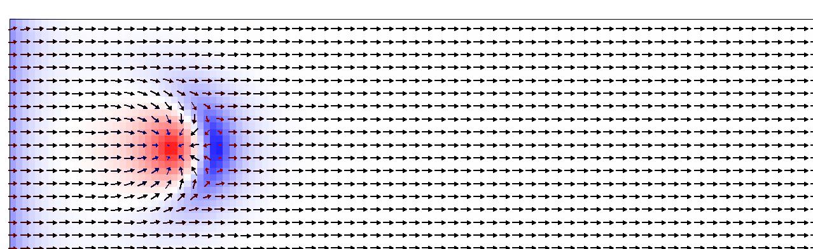

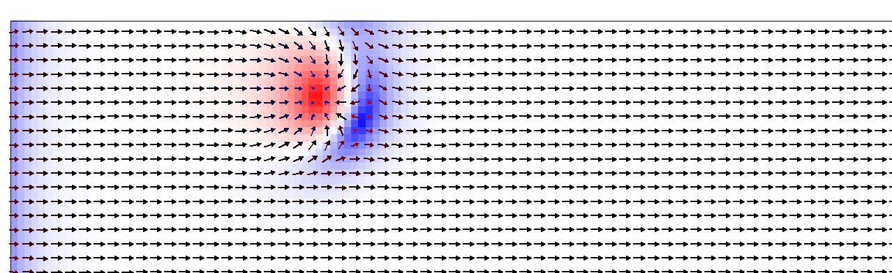

### 2 .set current_density_CPP 1e12;# A/m^2
 
缓慢的右上移动

### 3 .set current_density_CPP 5e10;# A/m^2
 
缓慢的右上移动

### 4 .set current_density_CPP 8e10;# A/m^2
 
缓慢的右上移动

***
**Relax 测试**
***
### SIMULATION WORLD
<li>set xlength  200.0e-9 ;# m</li>
<li>set ylength  200.0e-9 ;# m</li>
<li>set thickness  0.4e-9 ;# m</li>

### 1.DZYALOSHINSKI-MORIYA INTERACTION
**初始状态**
 
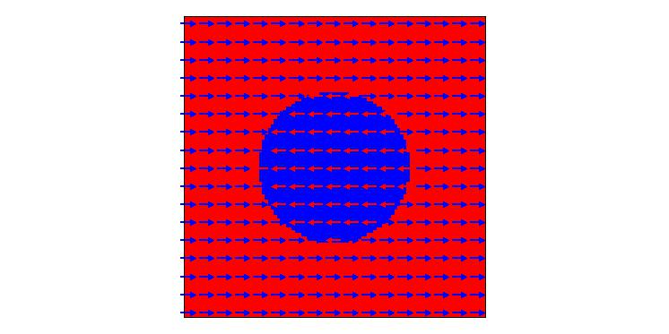

**set D 1.0 ;# mJ/m^2**
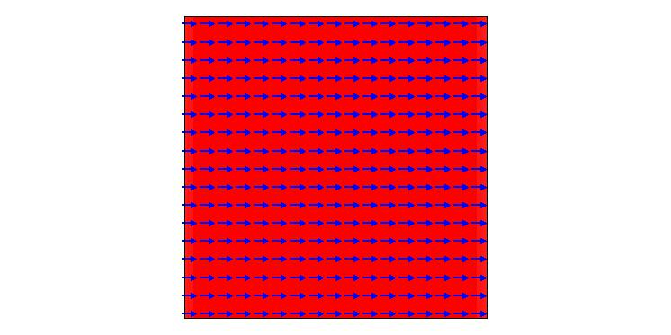

**set D 3.0 ;# mJ/m^2**
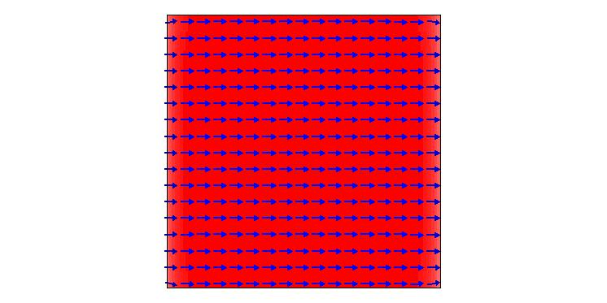

**set D 5.0 ;# mJ/m^2**
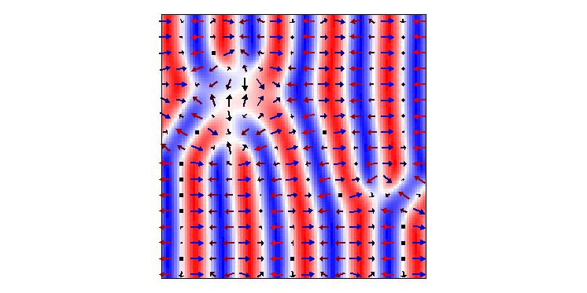

**set D 7.0 ;# mJ/m^2**
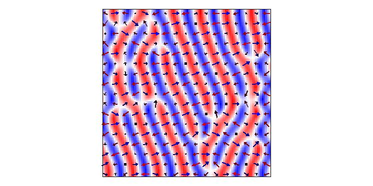

**D=5 有形成skyrmions的趋势，可以把A调大测试**

***
### 2.EXCHANGE STIFFNESS

**set A 10.0e-12 ;# J/m**
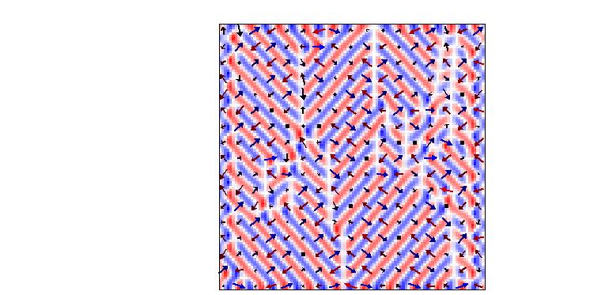

**set A 13.0e-12 ;# J/m**
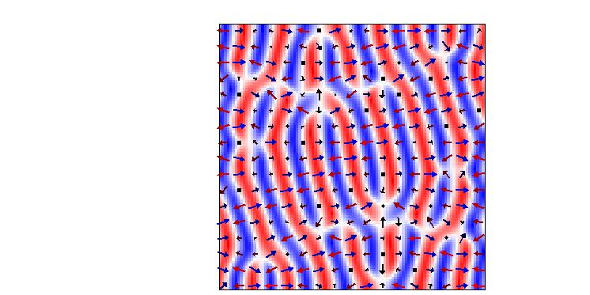

**set A 15.0e-12 ;# J/m**

**set A 17.0e-12 ;# J/m**
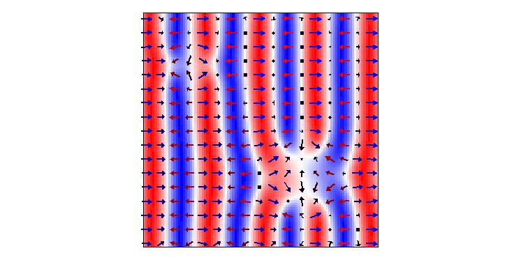
 
**set A 20.0e-12 ;# J/m**
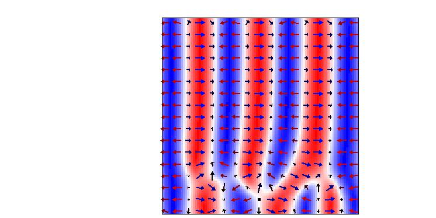

**D=5  K=15.0e-12 有形成skyrmions的趋势，可以把K调大测试**
***
### 3.UNIAXIAL ANISOTROPY

**set K      0.1e6 ;# J/m^3**
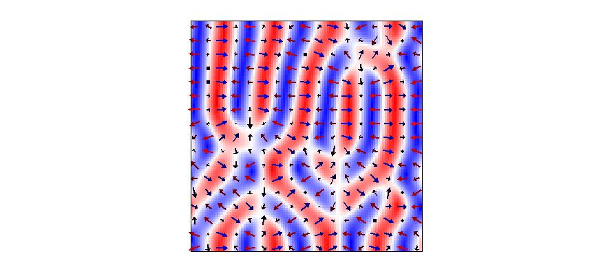
**set K      0.2e6 ;# J/m^3**

**set K      0.5e6 ;# J/m^3**
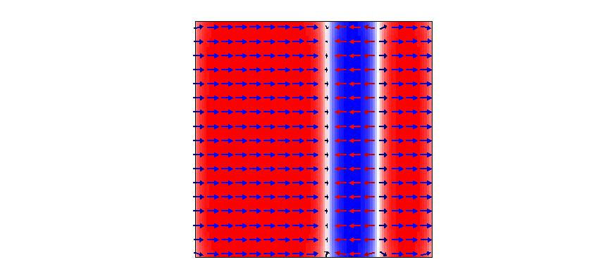

**set K      0.8e6 ;# J/m^3**
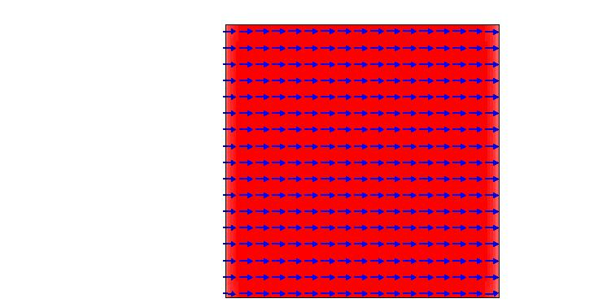

**500*500nm simualtion word**
***
### SIMULATION WORLD
<ul>set xlength  500.0e-9 ;# m</ul>
<ul>set ylength  500.0e-9 ;# m</ul>
<ul>set thickness  0.4e-9 ;# m</ul>

### set K      0.12e6 ;# J/m^3

2020-3-5
***
### 由于在500*500nm下relax失败，我们修改了relax的初始状态，这时我们让体系的初始状态就是Bimerons!

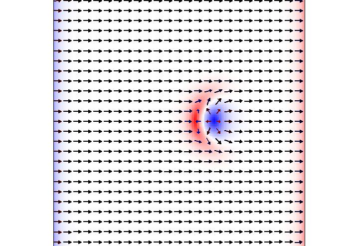

**realx之后的结果**
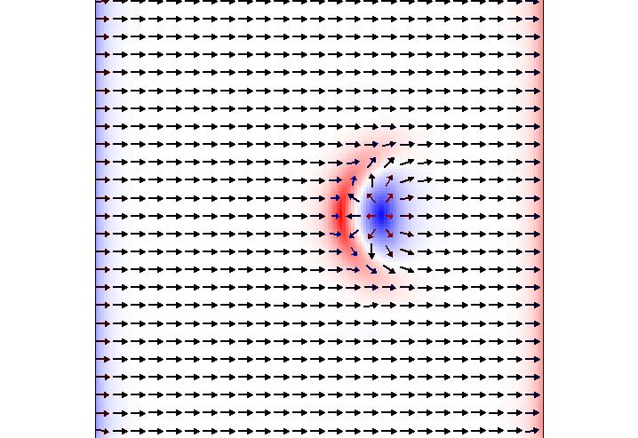

**把K值统一之后重新relax的结果**

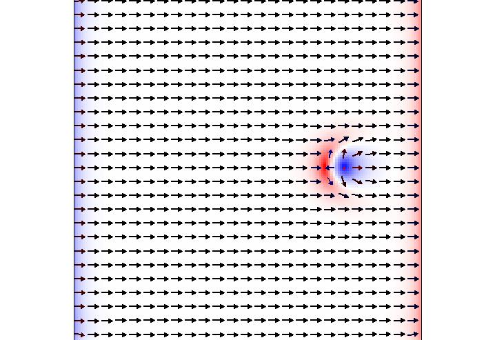

**500nm Atlas下Bimerons的动力学研究**
### 初始状态
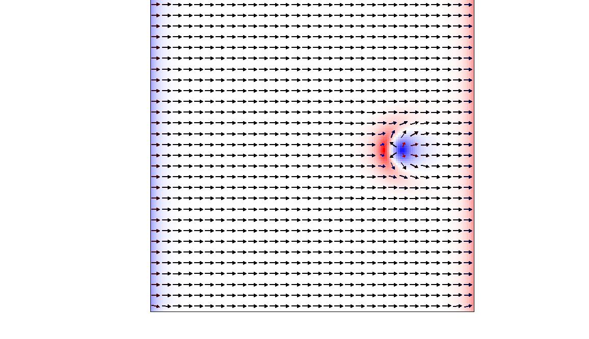
### 结束状态 set current_density_CPP 1e12;# A/m^2
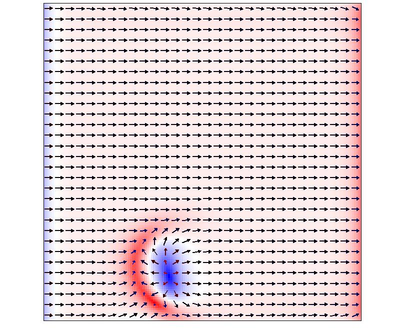

### 结束状态 set current_density_CPP 5e11;# A/m^2
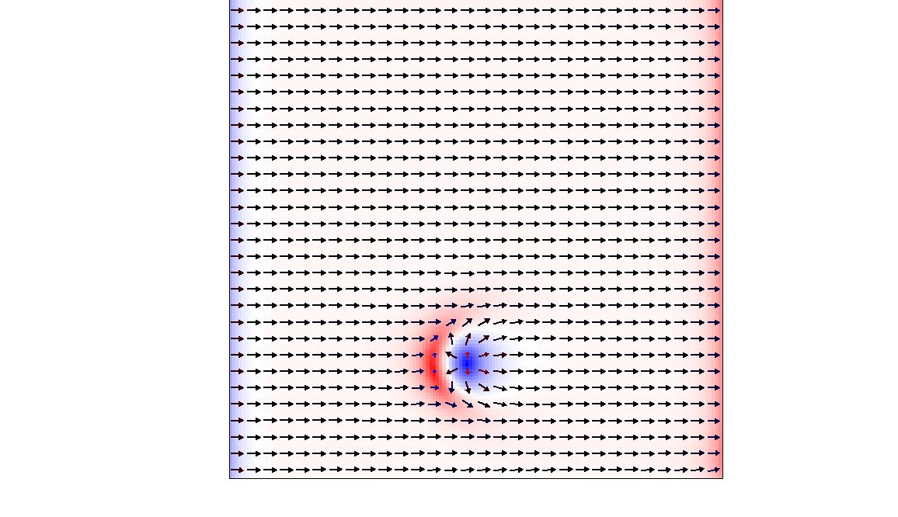
