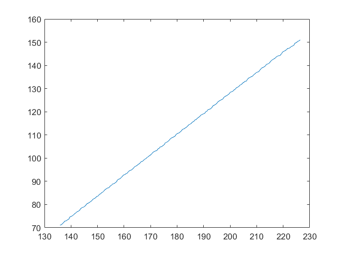

<font color=red size=5 face="TimesNewRoman"><b>current-induced shuttlecock-like movement of non-axisymmetric chiral skyrmions</b></font>
```
DOI:10.1038/s41598-019-56791-3
```
****
### Abstract:

<em>current-driven motion of non-axisymmetric skyrmions exhibits two distinct time regimes: initially the skyrmions rotate towards the current flow direction and subsequently move along the current with the skyrmionic crescent first.</em>

### 相图


### 动力学特征
- <b>Rotation of niS towards the Spc direction


- <b>translational movement of NISs


### 我们的实验结果
<center> 
    
    
</center>

<center> 
    
    
</center>

<center> 
    
    
</center>

        