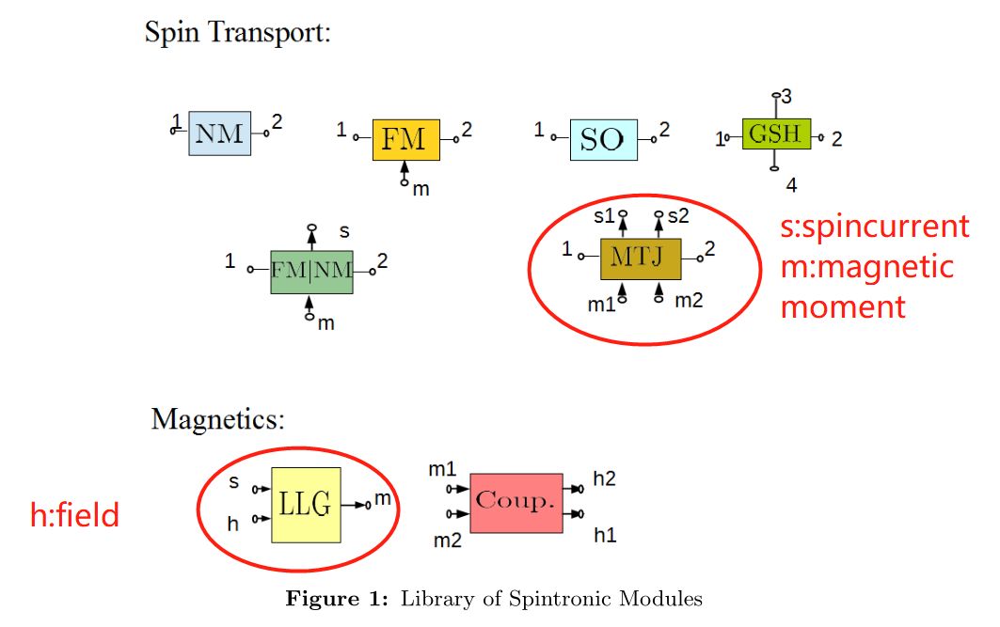
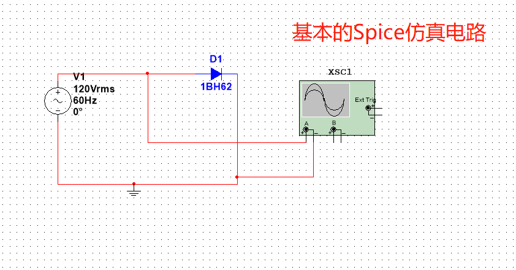
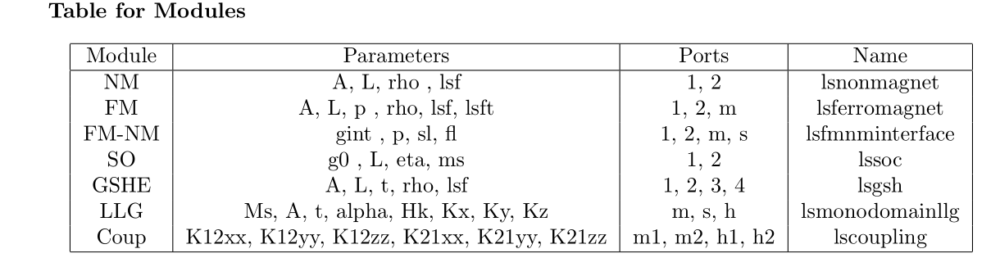
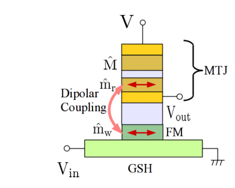
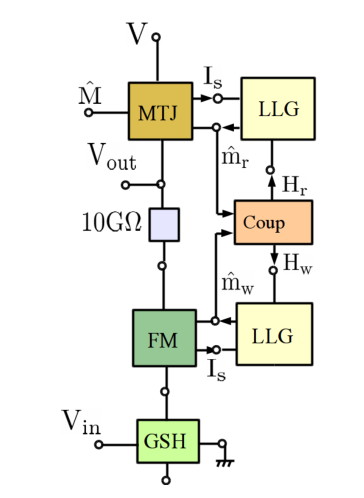
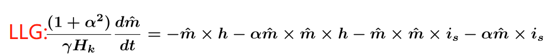
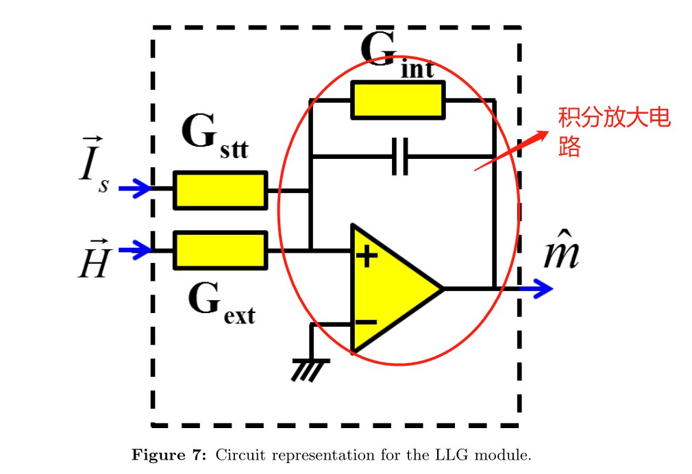
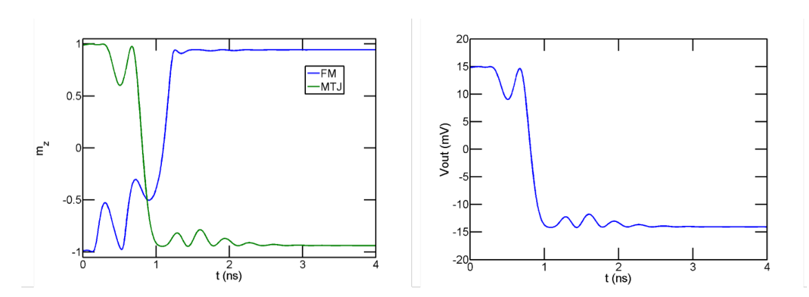

  Hspice simulation

1. Introduction

<!-- <ul>
<li><b>Non-Magnet (NM)</b>: Any material without any special magnetic properties, e.g. Cu, Si etc. This
module can be modeled using “spin diffusion theory”.
<li><b>Ferromagnet (FM)</b>: A magnetic material e.g. CoFe, NiMn (also called Permalloy) etc. This module
is modeled using spin diffusion theory.
<li> <b>Magnetic Tunnel Junction (MTJ)</b>: A composite device made of two magnets separated by a thin
tunneling oxide layer. This device requires a modle of its own because it cannot be broken down into simpler pieces using conventional circuit theories. The modules requires quantum transport theory(NEGF) for accurate modeling.
<li><<b>Magnet-Dynamics Solver (LLG)</b>: This module captures the dynamics of the magnetization of
thin film magnets. This modules, in contrast with the above modules, captures phenomena/behavior
rather than a physical sturcture in itself. The modules solves the Landau-Lifshitz-Gilbert Eqn in a
single-domain approximation, which is reasonably valid for magnet dimensions of the size encountered
in typical spintronic applications.
<li><b>Magnetic Coupling (Coup)</b>: A module used to capture the magnetic field/coupling between two
magnets/domains, e.g. in Spin Switch model it is used to model dipolar coupling between an FM and
an MTJ.
<li><b>Giant Spin Hall Effect (GSHE)</b>: A metallic material showing the Giant Spin Hall Effect, e.g. Pt,
Ta, W etc. This is modeled using spin diffusion equation.
</ul> -->

Where:
A = area, L = length, t = thickness, p = polarization, g0/gint = conductance, K = coupling coefficients,alpha = damping coefficient, Hk = anisotropy field magnitude, Ms = saturation magnetization.

2. Spin Switch Device

Figure 1:The single MTJ version has the normal MTJ as the reader, but the dual MTJ version has **two opposing fixed layers** with a shared common free layer

3. Modeling and Simulation of the Spin Switch
<figure class="half">
    
    
   
</figure>

Figure 2: Spin Switch device designs modeled as a **circuit built** of spintronic modules  Single MTJ Spin Switch

4. cicurit Model

5. Simulation Resullt

