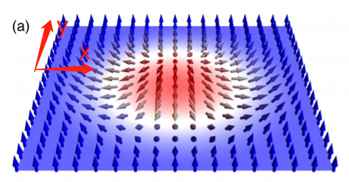
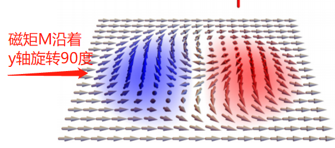
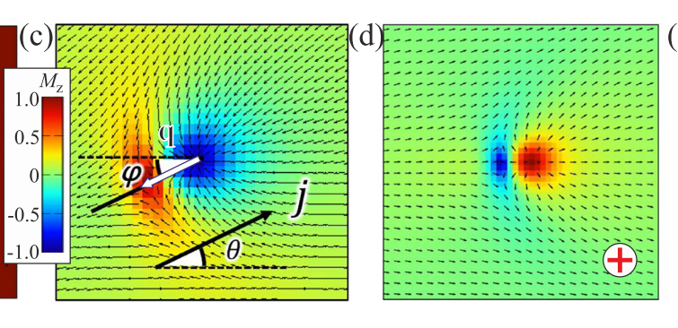
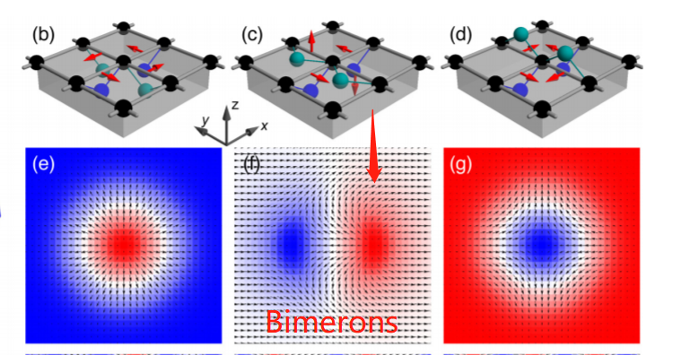

 Bimerons

 1. Bimerons 的形态对比

<figure class="half">
   
   
</figure>

<figutr>
    
</figure>

**NOTE**:上图a)表示的是在Science“current-induced shuttlecock-like movement of non-axisymmetric chiral skyrmions”一文中的实验结果，而图c)d)表示的是在PRB“Magnetic bimerons as skyrmion analogues in in-plane magnets”一文中的实验结果。 我们可以明显看到俩者的显著不同。俩类Bimerons形态的对称轴不同。图·c)d)也显然不符合图a)一文中的Skyrmions磁矩旋转90度的模型。

 2. Bimerons 的 Hamiltonian
对比

同时PRB一文中也**明确指出**The Dij have to beadjusted as well [42].而在Science一文中DMI直接使用的就是Skyrmions中的DMI没有做出任何调整。

