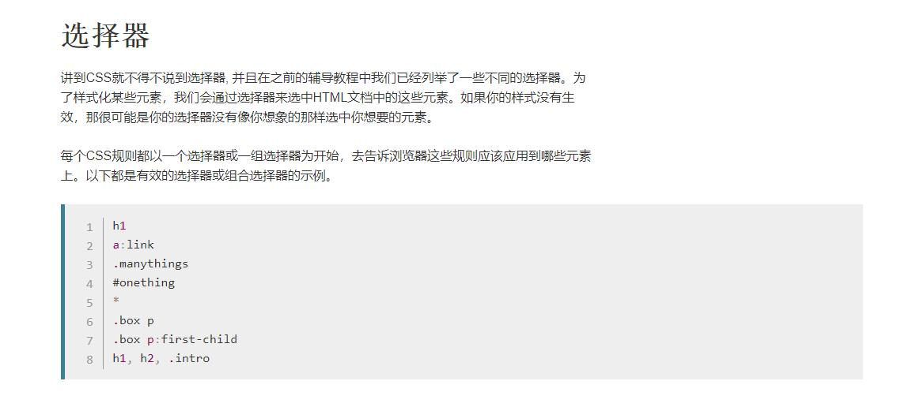
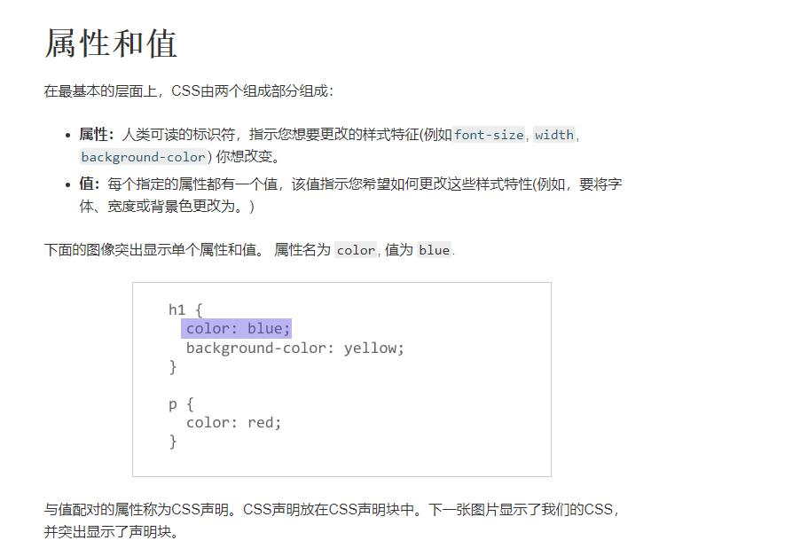
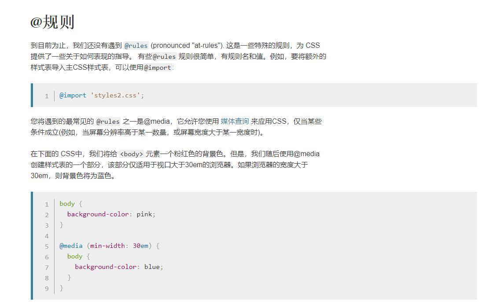
 导航栏（nav）的俩种布局方式
  
 1.导航栏位于header里面，参考观鸟网:E:\DOC\HTML5\MDN-HTML\CSS布局
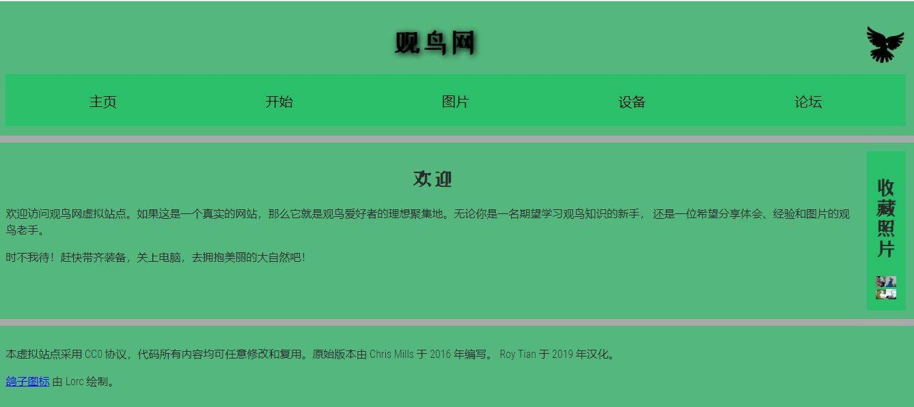

 2.导航栏位于边上，参考社区大学:E:\DOC\HTML5\MDN-HTML\CSS布局

 布局
 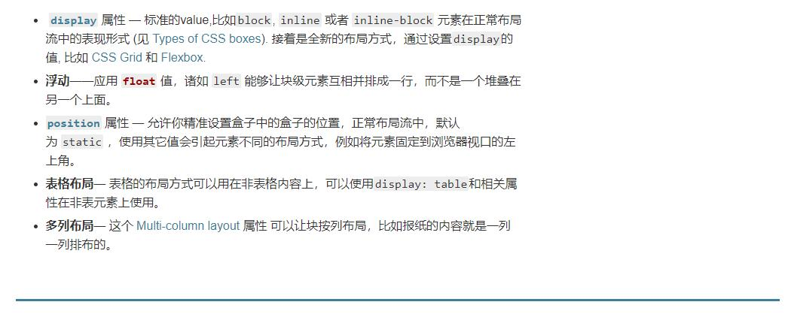
 
 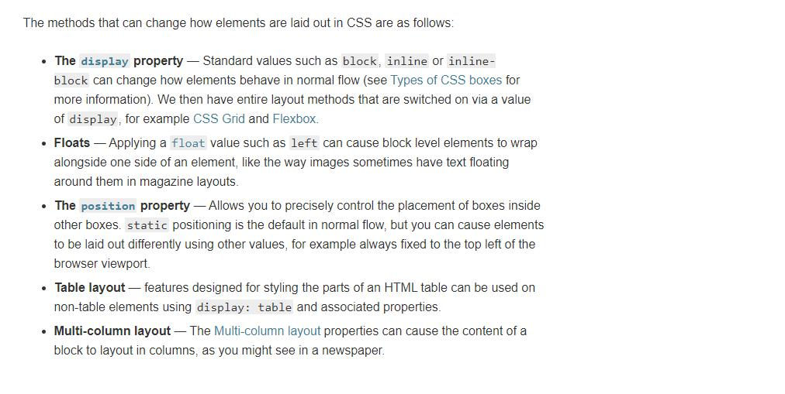
 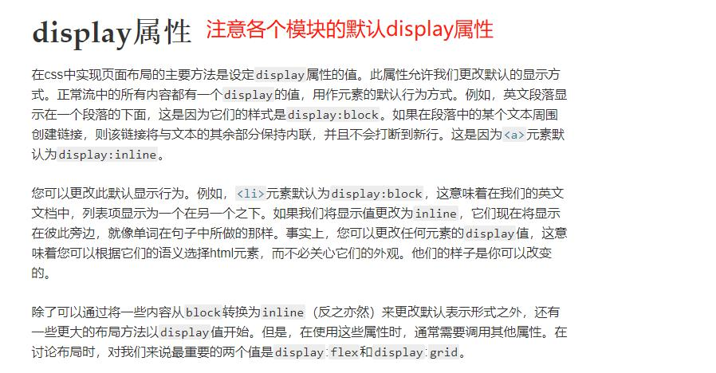
 
 
 **#flexbox**
 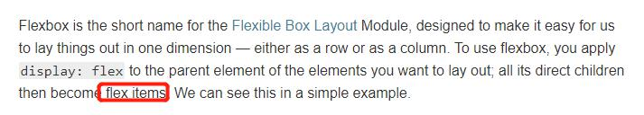
 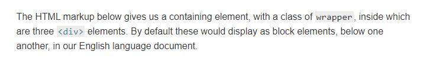
 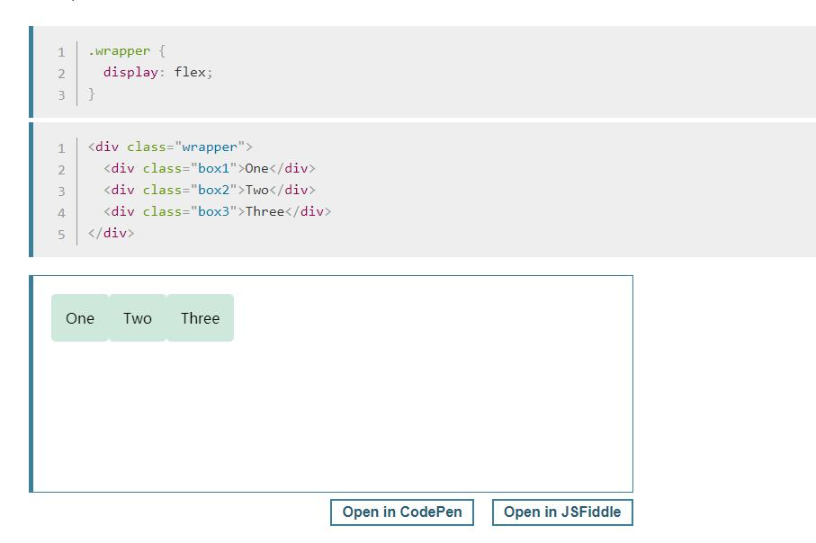
 
 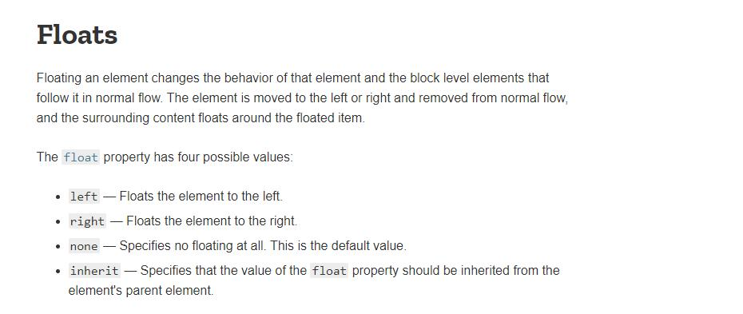
 
 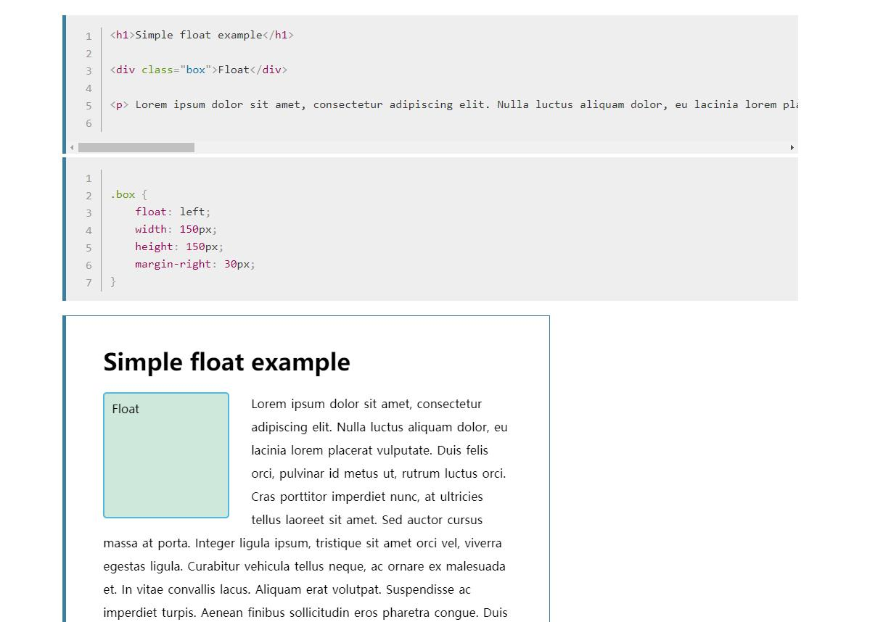
 
  **#position**
  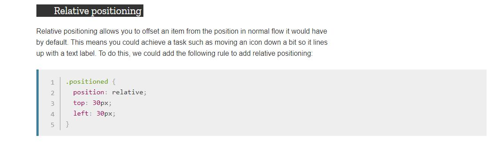
  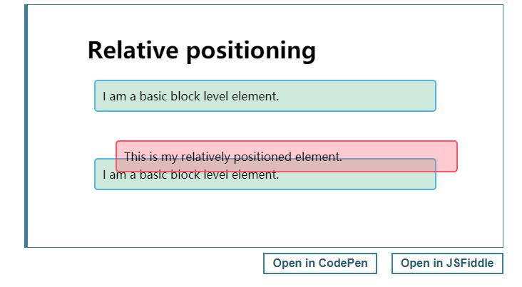
  
  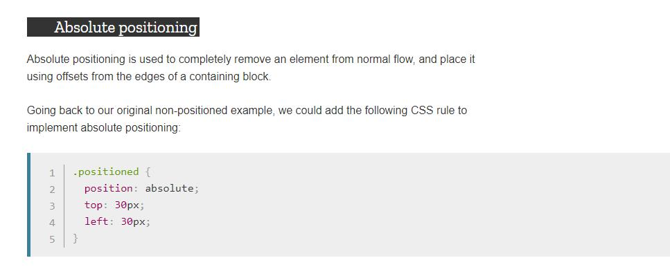
  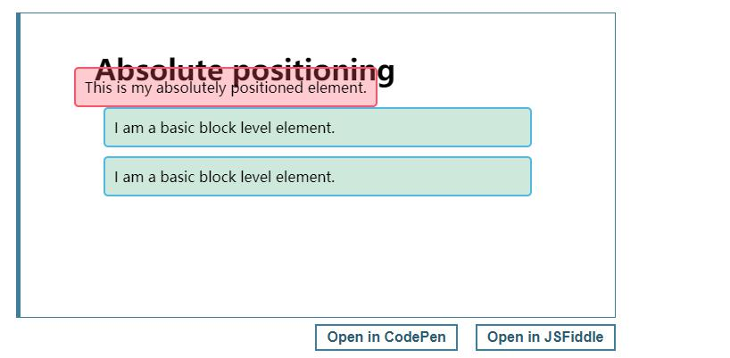
  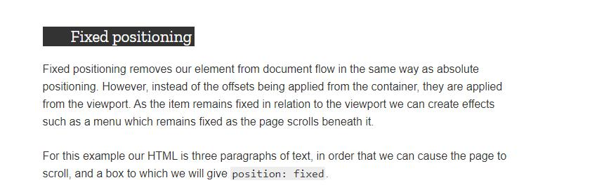
  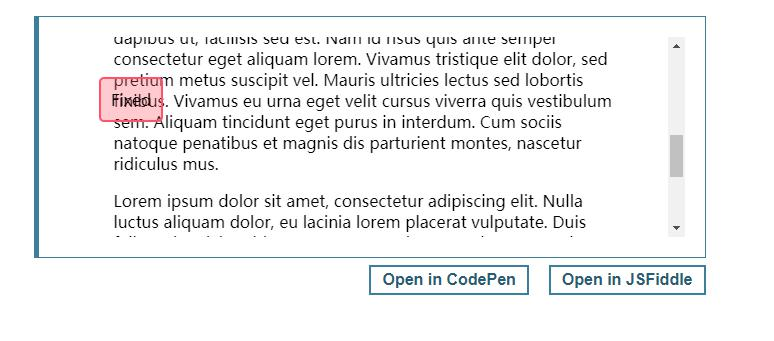
  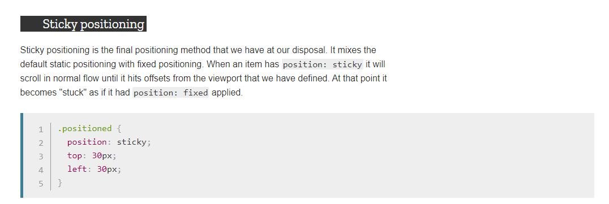
  
  
  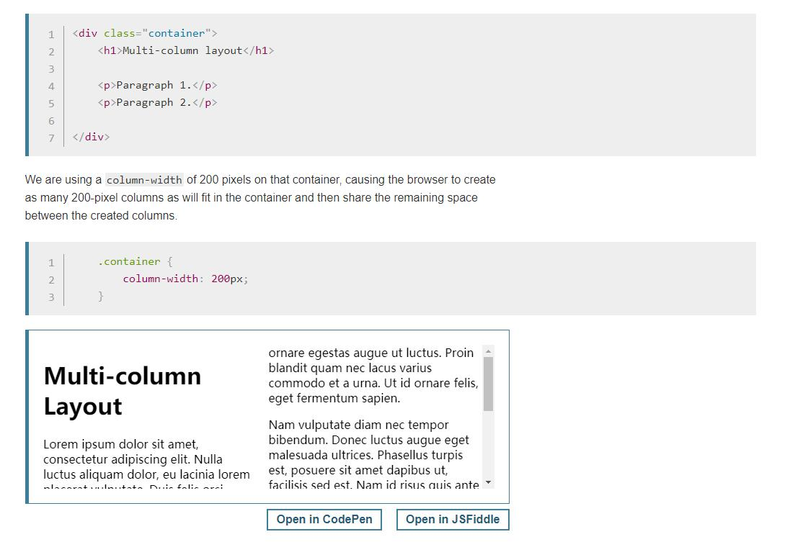