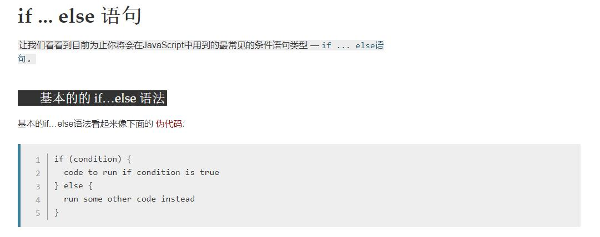
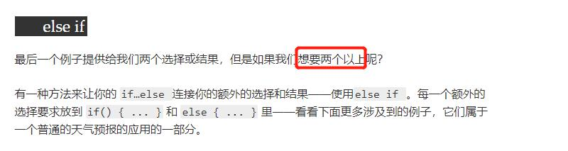
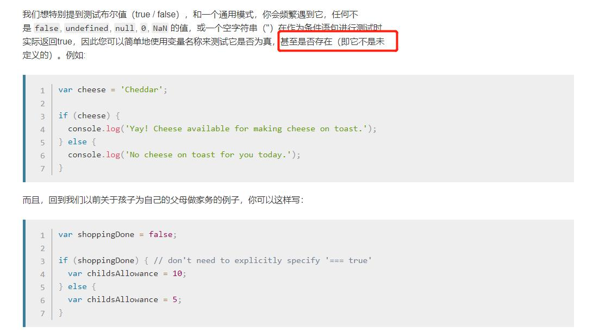
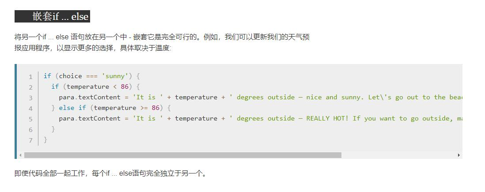
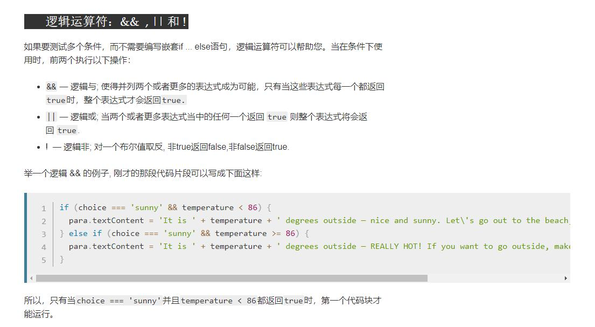
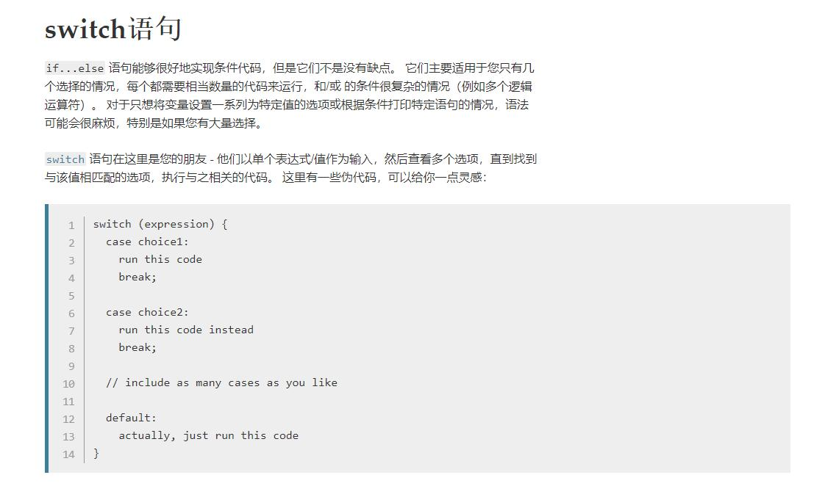
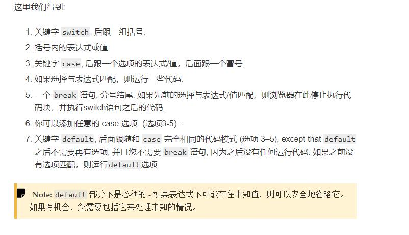
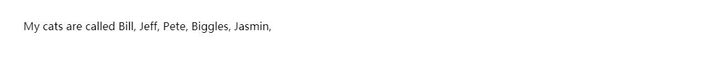
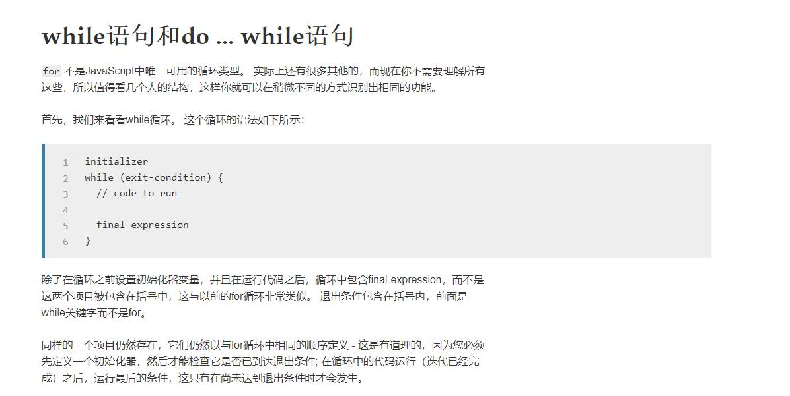

<font color=red size=6 face="宋体">**Javascript 基本语法**</font>




```javascript
<label for="weather">Select the weather type today: </label>
<select id="weather">
  <option value="">--Make a choice--</option>
  <option value="sunny">Sunny</option>
  <option value="rainy">Rainy</option>
  <option value="snowing">Snowing</option>
  <option value="overcast">Overcast</option>
</select>

<p></p>


var select = document.querySelector('select');
var para = document.querySelector('p');

select.addEventListener('change', setWeather);

function setWeather() {
  var choice = select.value;

  if (choice === 'sunny') {
    para.textContent = 'It is nice and sunny outside today. Wear shorts! Go to the beach, or the park, and get an ice cream.';
  } else if (choice === 'rainy') {
    para.textContent = 'Rain is falling outside; take a rain coat and a brolly, and don\'t stay out for too long.';
  } else if (choice === 'snowing') {
    para.textContent = 'The snow is coming down — it is freezing! Best to stay in with a cup of hot chocolate, or go build a snowman.';
  } else if (choice === 'overcast') {
    para.textContent = 'It isn\'t raining, but the sky is grey and gloomy; it could turn any minute, so take a rain coat just in case.';
  } else {
    para.textContent = '';
  }
}
```





 
***
***


```javascript
<label for="weather">Select the weather type today: </label>
<select id="weather">
  <option value="">--Make a choice--</option>
  <option value="sunny">Sunny</option>
  <option value="rainy">Rainy</option>
  <option value="snowing">Snowing</option>
  <option value="overcast">Overcast</option>
</select>

<p></p>
<!-- *********************************************************** -->
var select = document.querySelector('select');
var para = document.querySelector('p');

select.addEventListener('change', setWeather);


function setWeather() {
  var choice = select.value;

  switch (choice) {
    case 'sunny':
      para.textContent = 'It is nice and sunny outside today. Wear shorts! Go to the beach, or the park, and get an ice cream.';
      break;
    case 'rainy':
      para.textContent = 'Rain is falling outside; take a rain coat and a brolly, and don\'t stay out for too long.';
      break;
    case 'snowing':
      para.textContent = 'The snow is coming down — it is freezing! Best to stay in with a cup of hot chocolate, or go build a snowman.';
      break;
    case 'overcast':
      para.textContent = 'It isn\'t raining, but the sky is grey and gloomy; it could turn any minute, so take a rain coat just in case.';
      break;
    default:
      para.textContent = '';
  }
}
```


```javascript
var cats = ['Bill', 'Jeff', 'Pete', 'Biggles', 'Jasmin'];
var info = 'My cats are called ';
var para = document.querySelector('p');

for (var i = 0; i < cats.length; i++) {
  info += cats[i] + ', ';
}

para.textContent = info;
```




```javascript
var i = 0;

while (i < cats.length) {
  if (i === cats.length - 1) {
    info += 'and ' + cats[i] + '.';
  } else {
    info += cats[i] + ', ';
  }

  i++;
}
```
### do...while循环非常类似但在while后提供了终止条件
```javascript
initializer
do {
  // code to run

  final-expression
} while (exit-condition)
```
### 我们再次重写我们的猫列表示例，以使用do...while循环：
```javascript
var i = 0;

do {
  if (i === cats.length - 1) {
    info += 'and ' + cats[i] + '.';
  } else {
    info += cats[i] + ', ';
  }

  i++;
} while (i < cats.length);
```
