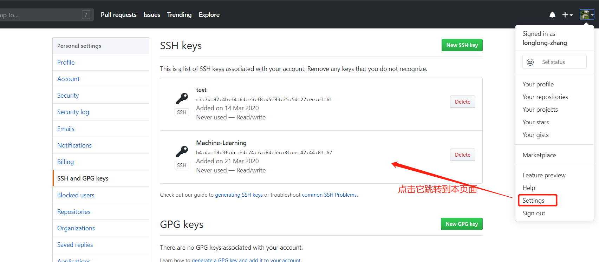
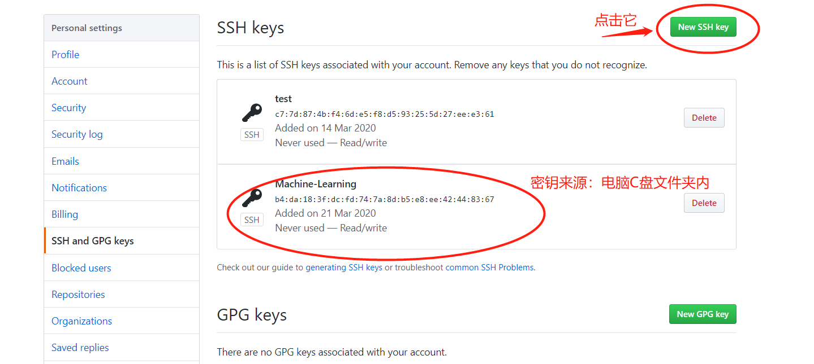

### 1.Git bash 下的账号设置
```
git config --global user.name "longlong-zhang"

git config --global user.email 18851856918@163.com

先建立一个Machine-Learning空文件夹
cd Machine-Learning
git init
# 这时Machine-Learning文件夹下多出一个隐藏文件夹.git

## 生成链接密钥
 ssh-keygen -t rsa -C "18851856918@163.com"
```
#### 在github页面上添加密钥



#### 把本地仓库链接到GitHub
git remote add origin https://github.com/longlong-zhang/Machine-Learning
#### 将本地的库推送到master分⽀支 
git push -u origin master

#### 把本地文件同步到GitHub


#### 记Git报错-refusing to merge unrelated histories
修改pull命令如下：git pull origin master --allow-unrelated-histories

#### 怎么同步到非master分支
```
git branch [name]
git push -u origin [name]
```
##### Note:
origin :暂存仓库（电梯）