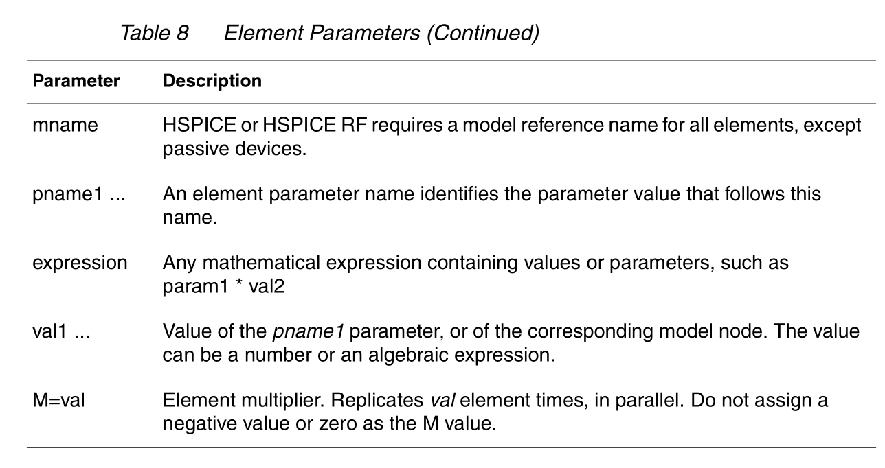

<b>&sect; &brvbar; 1.  HSPICE 简介</b>

****
**<em>Synopsys HSPICE is an optimizing analog circuit simulator. You can use it to simulate electrical circuits in steady-state, transient, and frequency domains.</em>**

HSPICE 是一个模拟电路仿真工具，功能有稳态模拟，瞬态模拟，频域模拟。

### Chapter 10: Parameters and Functions

 