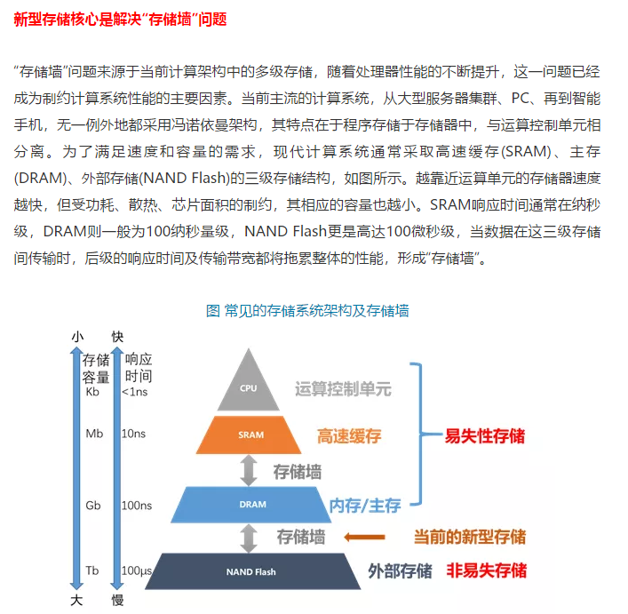
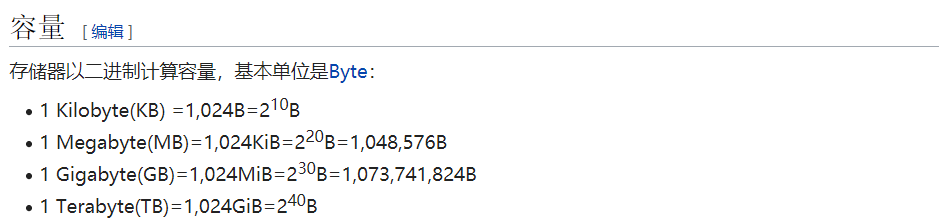
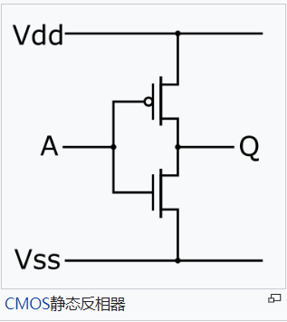
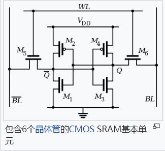
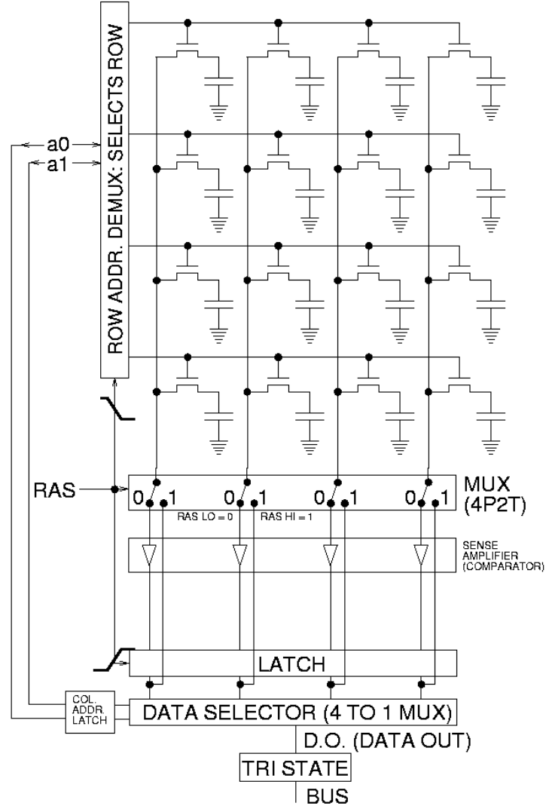

 存储器基础

MRAM基本知识 

[点击跳转存储器维基百科](https://zh.wikipedia.org/wiki/%E9%9B%BB%E8%85%A6%E8%A8%98%E6%86%B6%E9%AB%94)

#### 计算机内存和外存的区别
计算机存储器可分为内部存储器（简称内存或主存）和外部存储器，其中内存是CPU能直接寻址的存储空间，由半导体器件制成。**内存的特点是访问速率快**。我们平常使用的程序，如Windows操作系统、打字软件、游戏软件等，一般都是安装在硬盘等外存上的，但必须把它们调入内存中运行，才能真正使用其功能，我们平时输入一段文字，或玩一个游戏，其实都是在内存中进行的，数据产生后不断地由内存向外存进行刷写。就好比在一个书房里，存放书籍的书架和书柜相当于电脑的外存，而我们工作的办公桌就是内存。通常我们把要永久保存的、大量的数据存储在外存上，而把一些临时的或少量的数据和程序放在内存上，当然内存的好坏会直接影响电脑的运行速度。

#### 易失性存储器
易失性存储器（Volatile memory）是指当电源供应中断后，存储器所存储的数据便会消失的存储器。主要有以下的类型：

随机存取存储器
- 动态随机存取存储器，英文缩写写作DRAM，一般每个单元由一个晶体管和一个电容组成（后者在集成电路上可以用两个晶体管模拟）。特点是单元占用资源和空间小，**速度比SRAM慢，需要刷新**。一般计算机主内存即由DRAM组成。在PC上，DRAM以内存条的方式出现，DRAM颗粒多为4位或8位位宽，而载有多个颗粒的单根内存条的位宽为64位。
- 静态随机存取存储器，英文缩写写作SRAM，一般每个单元由6个晶体管组成，但近来也出现由8个晶体管构成的SRAM单元。**特点是速度快**，但单元占用资源比DRAM多。一般CPU的CPU缓存即由SRAM构成。

#### 非易失性存储器
非易失性存储器（Non-volatile memory）是指即使电源供应中断，存储器所存储的数据并不会消失，重新供电后，就能够读取存储器中的数据。 主要种类如下：

- 只读存储器（ROM）
 1.可编程式只读存储器（PROM）
 2.可擦除可规划式只读存储器（EPROM）
 3.电子抹除式可复写只读存储器（EEPROM）
 4.Flash ROM
- 磁存储
 1.硬盘
 2.软盘
 3.磁带
- 3D XPoint
- 固态硬盘
- 光存储
 光盘

SRAM简介 
**静态随机存取存储器（Static Random Access Memory，SRAM**是随机存取存储器的一种。所谓的“静态”，是指这种存储器只要保持通电，里面储存的数据就可以恒常保持[1]。相对之下，动态随机存取存储器（DRAM）里面所储存的数据就需要周期性地更新。然而，当电力供应停止时，SRAM储存的数据还是会消失（被称为volatile memory），这与在断电后还能储存资料的ROM或闪存是不同的。

#### SRAM电路结构
<figure class="half">
    
    
   
</figure>

#### 原理
SRAM由存储矩阵、地址译码器和读/写控制电路组成，容量的扩展有两个方面：位数的扩展用芯片的并联，字数的扩展可用外加译码器控制芯片的片选输入端[2]。SRAM中的每一bit储存在由4个场效应管（M1, M2, M3, M4）构成两个交叉耦合的反相器中。另外两个场效应管（M5, M6）是储存基本单元到用于读写的位线（Bit Line）的控制开关。

**反相器**是一种电路器件，其输出是输入的逻辑非。如图所示的CMOS静态反相器，由两个互补的金属氧化物半导体场效应管（MOSFET）组成，源极连接在高电平的是P沟道场效应管，源极连接在低电平的是N沟道场效应管。输入电路接在两个场效应管的栅极上，输出电路从两个场效应管的连接处接出。当输入低电平，则P沟道场效应管开通，N沟道场效应管关闭，输出高电平。当输入高电平，则N沟道场效应管开通，P沟道场效应管关闭，输出低电平。这就实现了“反相”输出。

一个SRAM基本单元有0 and 1两个电平稳定状态。SRAM基本单元由两个CMOS反相器组成。两个反相器的输入、输出交叉连接，即第一个反相器的输出连接第二个反相器的输入，第二个反相器的输出连接第一个反相器的输入。这就能实现两个反相器的输出状态的锁定、保存，即储存了1个位元的状态

DRAM简介 
动态随机存取存储器（Dynamic Random Access Memory，DRAM）是一种半导体存储器，主要的作用原理是利用**电容内存储电荷的多寡**来代表一个二进制比特（bit）是1还是0。由于在现实中晶体管会有漏电电流的现象，导致电容上所存储的电荷数量并不足以正确的判别数据，而导致数据毁损。因此对于DRAM来说，**周期性地充电**是一个不可避免的条件。由于这种需要定时刷新的特性，因此被称为“动态”存储器。相对来说，静态存储器（SRAM）只要存入数据后，纵使不刷新也不会丢失记忆。

与SRAM相比，DRAM的优势在于结构简单——每一个比特的数据都只需一个电容跟一个晶体管来处理，相比之下在SRAM上一个比特通常需要六个晶体管。正因这缘故，DRAM拥有非常高的密度，单位体积的容量较高因此成本较低。但相反的，DRAM也有访问速度较慢，耗电量较大的缺点。

与大部分的随机存取存储器（RAM）一样，由于存在DRAM中的数据会在电力切断以后很快消失，因此它属于一种易失性存储器（volatile memory）设备。
#### 电路原理图

DRAM通常以一个电容和一个晶体管为一个单元排成二维矩阵，左图所示是一个4×4的矩阵。基本的操作机制分为读(Read)和写(Write)，读的时候先让Bitline(BL)先充电到操作电压的一半，然后在把晶体管打开让BL和电容产生电荷共享的现象，若内部存储的值为1，则BL的电压会被电荷共享抬高到高于操作电压的一半，反之，若内部存储的值为0，则会把BL的电压拉低到低于操作电压的一半，得到了BL的电压后，在经过放大器来判别出内部的值为0和1。写的时候会把晶体管打开，若要写1时则把BL电压抬高到操作电压使电容上存储著操作电压，若要写0时则把BL降低到0伏特使电容内部没有电荷。

SSD简介 
固态硬盘或固态驱动器（英语：Solid-state drive或Solid-state disk，简称SSD）是一种主要以<b>闪存(NAND Flash)</b>作为永久性存储器的电脑存储设备。
固态硬盘采用SATA、PCI Express、M.2、mSATA、SAS、U.2、ZIF、IDE、CF、CFast等接口。由于价格及存储空间与机械硬盘有巨大差距，固态硬盘无法取代机械式硬盘。