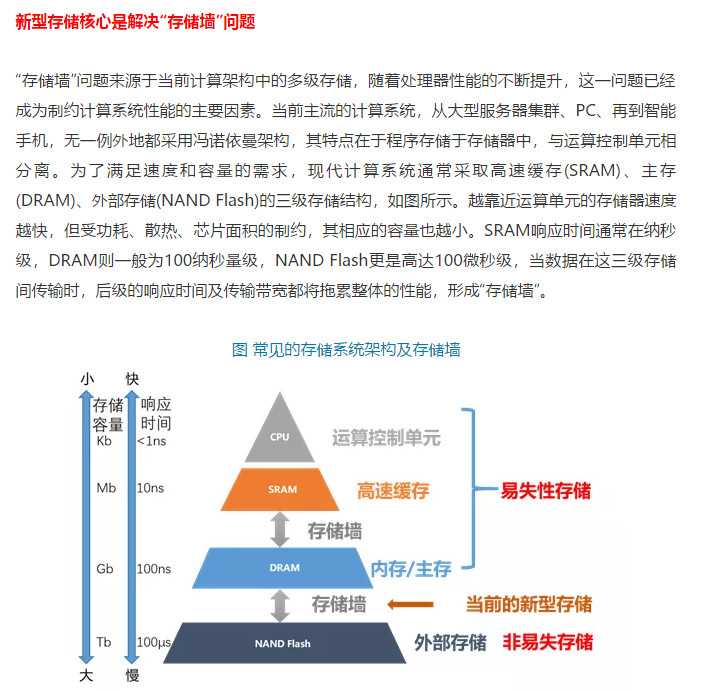

<center><font color=red size=6 face="Times New Roman">  海康面试</font></center><hr/>
```账号：2013_zll
密码：zhangll_1918

时间：2020/4/10 下午俩点
```
<font color=blue size=5 face="华文中宋">自我介绍环节 </font>
 海康驰拓的各位前辈们下午好，我是南京大学电子学院2018级的硕士研究生张龙龙，在研究生期间主要从事磁性存储器MRAM相关的科研工作。在学业的第一阶段我主要负责实验室磁控溅射平台的搭建。在学业的第二阶段（研二开始）我开始从事磁性存储器MRAM仿真工作，这期间采用Mumax3仿真手段系统模拟的垂直形状各向异性存储器，也就是PSA-MRAM的各项性质。到目前为止，有一篇磁性存储器（MRAM）的第一作者SCI论文在投。同时通过英语六级考试，有较强的英文读写能力。最后，我非常希望能加入到国内最顶尖的MRAM团队-海康驰拓，来继续从事MRAM相关的工作。我的介绍到此完毕，谢谢大家耐心的聆听！ 

<font color=blue size=5 face="华文中宋">提问海康环节 </font>
1.驰拓MRAM产品的应用方向，
2.目前MRAM的驱动手段STT?有考虑采用SOT这些新技术吗？
3.驰拓目前是更着重于MRAM器件的研发，还是MRAM的应用？
<font color=blue size=5 face="华文中宋">海康驰拓基本资料 </font>
**浙江驰拓科技有限公司**   成立于2016年1月，致力于新型高端存储器件的研发与产业化， 坚持以市场引领为导向，紧紧抓住自身产品的优势应用领域——物联网、 高速数据存取以及高安全性


**团队**
团队成员的专业领域涵盖了存储器产品开发与生产，包括电路与器件设计、先进制造工艺、器件与芯片的测试以及应用开发等各个环节，具备了高端存储器的自主设计以及制造能力。

**产品**


**独立式MRAM产品参数**

**嵌入式MRAM**


<font color=blue size=5 face="华文中宋">MRAM基本知识 </font>


[点击跳转存储器维基百科](https://zh.wikipedia.org/wiki/%E9%9B%BB%E8%85%A6%E8%A8%98%E6%86%B6%E9%AB%94)

<font color=blue size=5 face="华文中宋">面试总结 </font>
1.几种各项异性
磁晶，形状，界面，磁弹

2.LLGS方程

3.MRAM器件的核心组成MTJ，垂直膜MTJ的优势？

4.P to AP 和AP to P 哪个电流小

5.退磁场在铁磁体中对的作用。

