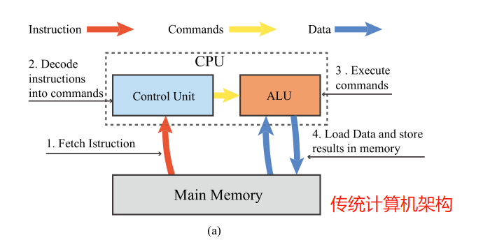
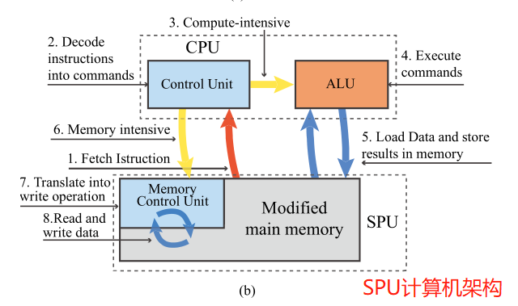
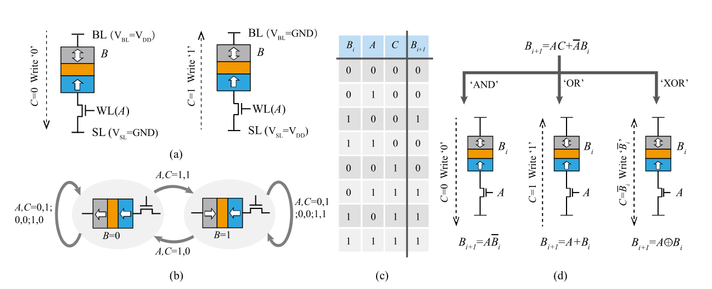
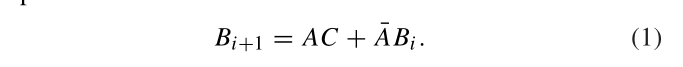
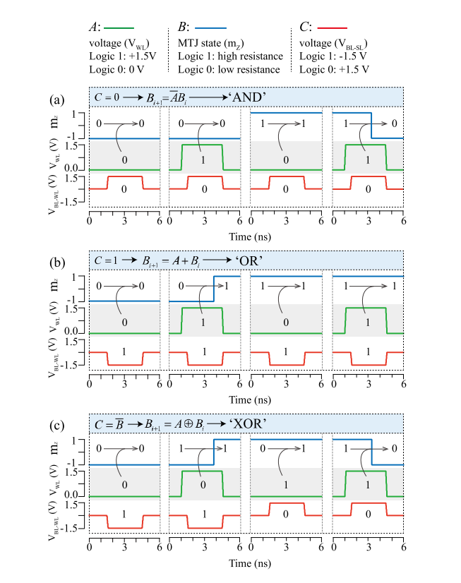
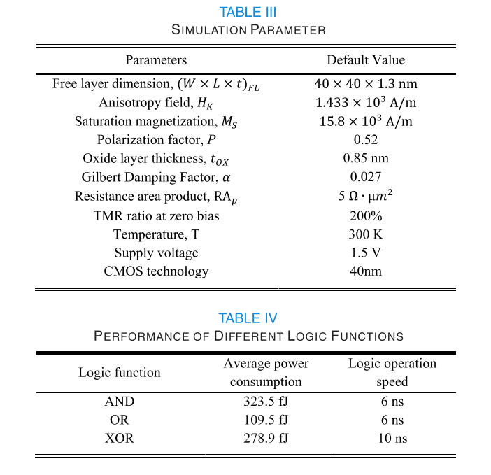
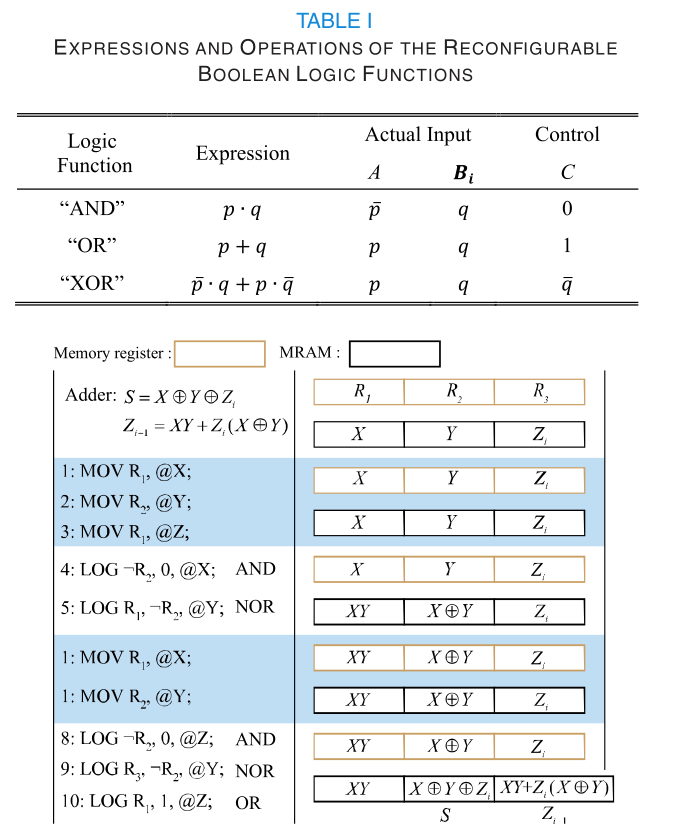
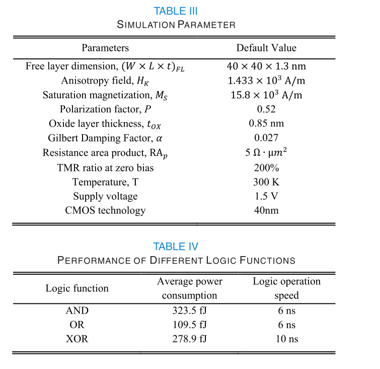

 Spintronic Processing Unit in Spin Transfer
Torque Magnetic Random Access Memory

<a href="https://doi.org/10.1109/TED.2019.2898391">点击跳转原文</a>  
Group Meeting Report

### 一、背景介绍
OVER the past decades, there is an explosive growth in data size, especially in current big data and machine learning applications. However, regarding conventional von Neumann architecture, the overhead of the data communica-tion between the processor and the memory units results in huge performance degradation and energy consumption, called von Neumann bottleneck [1], [2]. In order to overcome this bottleneck, a hopeful approach is to embed processing capability into the memory, termed **processing-in-memory (PIM)**[3]–[6], which has attracted considerable interests.
<figure class="half">
    
    

</figure>

- the convention von Neuman architecture is composed by a central processing unit (CPU) and main memory. Besides, the CPU consists of the control unit and the <b>arithmetic logical unit (ALU) </b>. For a complete cycle,first, the instruction is fetched from the main memory to the control unit. Then, the control unit decodes the instruction into commands which can be performed by the ALU. Finally, the ALU executes these commands. It reads data from the main memory, calculates them, and stores the computing results
back.

- First, the instruction is fetched from the main memory to the control unit and decodes the instruction into commands. Then, if this task is marked with compute intensive, it will be completed by the ALU, just like in a typical von Neuman architecture. Otherwise, if the task is marked with memory intensive, the commands will be sent back to the memory control unit. Then, the memory control unit translates these commands into a series of write and read operations. Finally, the task is achieved in the modified main memory, and the results are in-situ stored in it. It should be noted that the software support (out of the scope of this paper) is required to distribute different tasks to either CUP or SPU in the proposed architecture.

### 二、存算一体逻辑单元设计

### 三、spintronic processing unit (SPU)实现
<figure class="half">
    
    
   
</figure>

<!-- ### 四、PIM Machine 最终实现
The simulation was performed using a 40-nm CMOS design kit and a compact MTJ model [26]. Hybrid CMOS/MTJ circuits were designed and simulated to evaluate the function-ality and performance of the proposed SPU in STT-MRAM. Some key parameters are shown in Table III. Fig. 6 shows the transient simulation waveforms of the “ AND ,” “ OR ,” and “ XOR ” logic functions, respectively.
<figure class="half">
    
      
</figure> -->

### 四、总结
We proposed an efficient and reconfigurable PIM platform—SPU—in typical 1T1MTJ-based STT-MRAM. The proposed SPU utilized the memory cell at the finest grain to perform logic computing task through regular memory-like write and read operations with minimal modifications. Our hybrid CMOS/MTJ circuit simulations verified the functionality and performance of the proposed design. It can be argued that this paper is a natural evolution of the PIM paradigm, by moving towards finer-grained and highly parallel structures. As STT-MRAM has recently been a commercialized product, our proposed SPU is expected to be a practical PIM platform.

