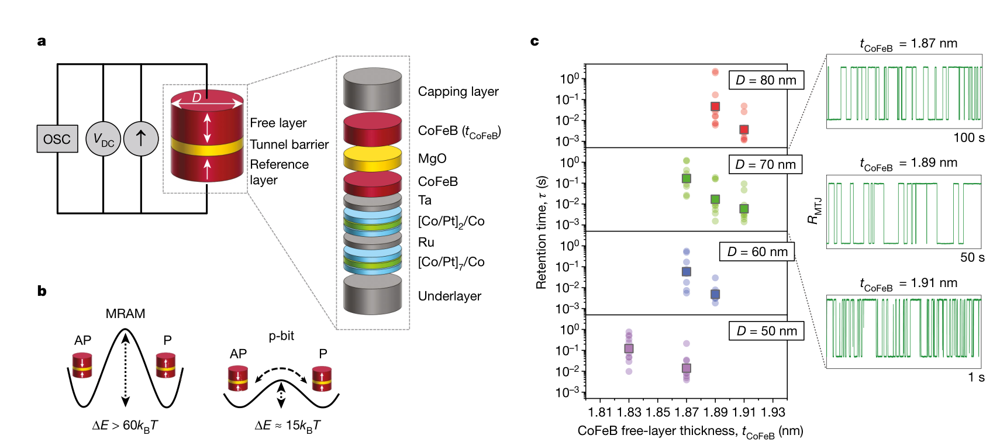
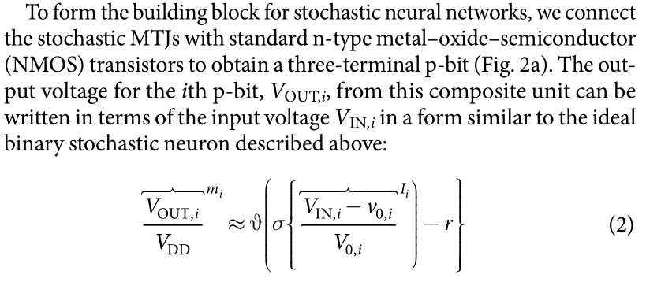
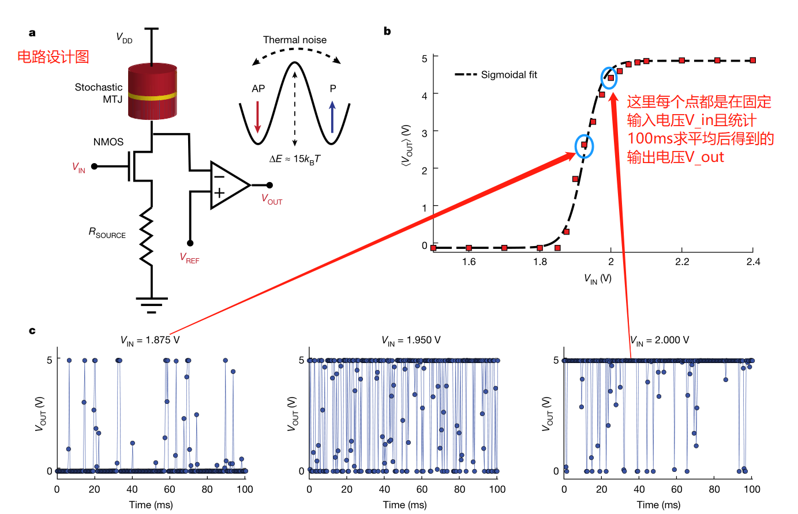
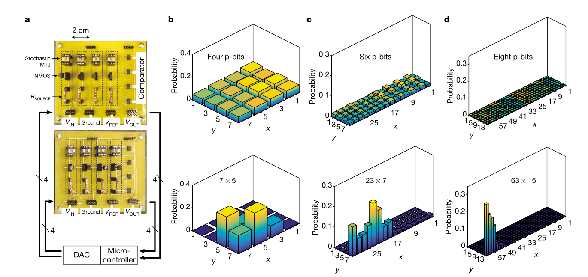

 Integer factorization using stochastic magnetic
tunnel junctions

<a href="https://doi.org/10.1038/s41586-019-1557-9">点击跳转原文</a>  
Group Meeting Report

### 一、概率比特器件
 
**introduction:** A magnetic tunnel junction (MTJ), widely recognized as a critical building block of nonvolatile magnetoresistive random-access memory (MRAM) [10,11] , has potential to be used as the stochastic element in p-bits [16] if its thermal stability can be sufficiently reduced.

**Abstract:** In this work, we build stochastic MTJs and demonstrate an experimental proof of concept of probabilistic computing, in which aneight-p-bit network performs integer factorization of values up to 945.

**Background:** The building block of the p-bit, the MTJ,comprises ferromagneticfree and reference layers separated by an insulating tunnel barrier(Fig. 1a). Previous studies have used the switching probability [17] and fluctuation rate of the free-layermagnetization of separate MTJs to show random-number generation and population coding, respectively.Here we show that complex optimization problems can be generally addressed using the correlation among multiple naturally stochastic MTJs. 

### 二、MRAM基本原理
- The high (antiparallel,AP) and low (parallel, P) resistance states (R AP , R P ) are separated by an energy barrier E such that stored information is retained for a time 
$$ τ = τ_0 exp[E/(k B T)]$$ following Arrhenius’ law, where is the attempt time$(τ 0  ≈ 1 ns)$[20] , k B is the Boltzmann constant and T is the temperature (Fig. 1b) 

- Nonvolatile memory applications require stable MTJs with a retention time τ of the order of years [11] , whereas our p-bit experiments require stochastic MTJs with retention times on the millisecond scale. 
非挥发性MRAM要求稳定时间$τ$长达数年，但是p-bit器件要求MTJ的稳定时间$τ$最多不超过毫秒级别！

**Fig. 1 | Characteristics of stochastic magnetic tunnel junctions.**
**a**, Measurement setup of a stochastic MTJ. **b**, The energy profile between the P and AP states **c**, Experimental results showing the retention time $ τ $ of MTJs with varying thickness of the CoFeB

### 三、p-bit器件的构建

<b>Fig. 2 | Experimental demonstration of a p-bit.</b>

### 四、实验验证

**Fig. 3 | Experimental demonstration of integer factorization**.
**a**, A photograph of a printed circuit board for an eight-p-bit circuit,interconnected through a microcontroller and a DAC. **b–d**, Theuncorrelated (top) and correlated (bottom) state of the system when four,six and eight p-bits are used to factorize.
