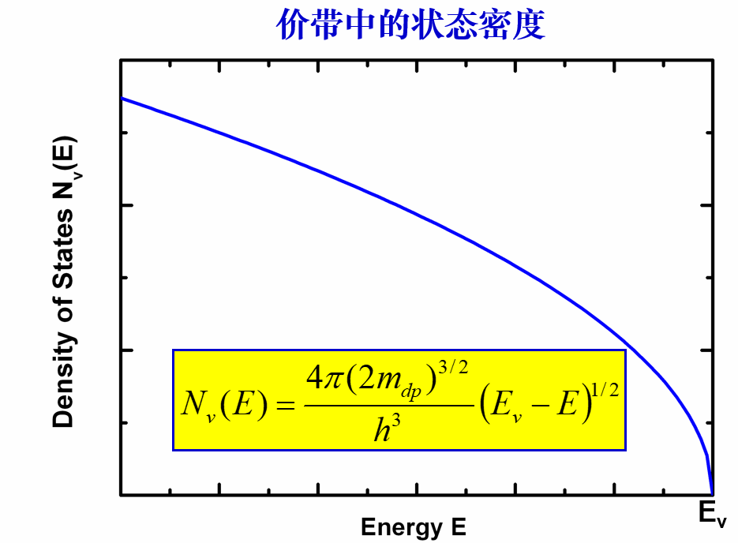

<b>&sect; &brvbar; 知识点汇总</b>

****
### 一、半导体物理
- 晶体结构

**Si 最容易解离的晶面是{111}面 GaAs最容易解离的晶面是{110}面**

- 倒格子

 
 
 
 
 
 <figure class="half">
    
    
   
</figure>

 
 <figure class="half">
    
</figure>

 
 
 
 
 
 

