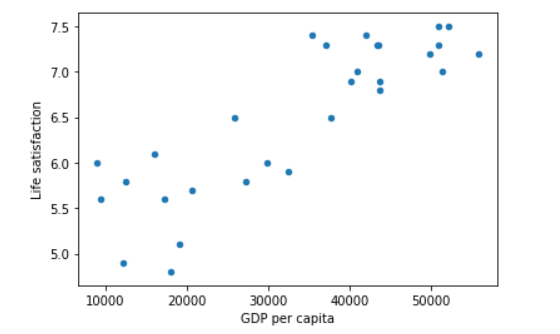

## 人工智能基础知识
#### 人工智能-机器学习-深度学习的关系


##### 机器学习的特征


#### What is Machine Learning


#### Types of Machine Learning Systerms

****


****


##### instance based learning


##### Example 1-1. Training and running a linear model using Scikit-Learn
```
import matplotlib
import matplotlib.pyplot as plt
import numpy as np
import pandas as pd
from sklearn.linear_model import LinearRegression
# 函数定义
def prepare_country_stats(oecd_bli, gdp_per_capita):
    oecd_bli = oecd_bli[oecd_bli["INEQUALITY"]=="TOT"]
    oecd_bli = oecd_bli.pivot(index="Country", columns="Indicator", values="Value")
    gdp_per_capita.rename(columns={"2015": "GDP per capita"}, inplace=True)
    gdp_per_capita.set_index("Country", inplace=True)
    full_country_stats = pd.merge(left=oecd_bli, right=gdp_per_capita,
                                  left_index=True, right_index=True)
    full_country_stats.sort_values(by="GDP per capita", inplace=True)
    remove_indices = [0, 1, 6, 8, 33, 34, 35]
    keep_indices = list(set(range(36)) - set(remove_indices))
    return full_country_stats[["GDP per capita", 'Life satisfaction']].iloc[keep_indices]
# Load the data
gdp_per_capita = pd.read_csv(r"C:\Users\18851\Desktop\machine learning\handson-ml\datasets\lifesat\gdp_per_capita.csv",thousands=',',delimiter='\t', encoding='latin1', na_values="n/a")
oecd_bli = pd.read_csv(r"C:\Users\18851\Desktop\machine learning\handson-ml\datasets\lifesat\oecd_bli_2015.csv", thousands=',')

# Prepare the data
country_stats = prepare_country_stats(oecd_bli, gdp_per_capita) 
X = np.c_[country_stats["GDP per capita"]]
y = np.c_[country_stats["Life satisfaction"]]
# Visualize the data
country_stats.plot(kind='scatter', x="GDP per capita", y='Life satisfaction') 
plt.show()
```

```
# Select a linear model
lin_reg_model = sklearn.linear_model.LinearRegression()
# Train the model
lin_reg_model.fit(X, y)
# Make a prediction for Cyprus
X_new = [[22587]] # Cyprus' GDP per capita
print(lin_reg_model.predict(X_new)) # outputs [[ 5.96242338]]
```


